# MassTree Architecture

Complete architectural overview of the MassTree implementation after all phases are complete.

> **Document Status:** This is a **target architecture** document describing the complete design.
> Features are labeled by implementation phase:
> 
> - **(P1)** Phase 1 - Implemented (single-threaded, 0-8 byte keys)
> - **(P2)** Phase 2 - Planned (trie layering, arbitrary key lengths)
> - **(P3)** Phase 3 - Planned (concurrency, epoch-based reclamation)
> - **(P4)** Phase 4 - Planned (scan, remove operations)
> - **(P5)** Phase 5 - Planned (optimizations)
>
> **Current Code:** Phase 1 complete. See `src/lib.rs` for constraints.

## Table of Contents

1. [High-Level Overview](#high-level-overview)
2. [Module Dependency Graph](#module-dependency-graph)
3. [Data Structure Hierarchy](#data-structure-hierarchy)
4. [Trie of B+Trees Structure](#trie-of-btrees-structure)
5. [Node Structures](#node-structures)
6. [Operation Flows](#operation-flows)
7. [Concurrency Model](#concurrency-model)
8. [Memory Management](#memory-management)
9. [Value Storage Modes](#value-storage-modes)
10. [Phase Progression](#phase-progression)

---

## High-Level Overview

MassTree is a high-performance concurrent key-value store combining **tries** and **B+trees**:

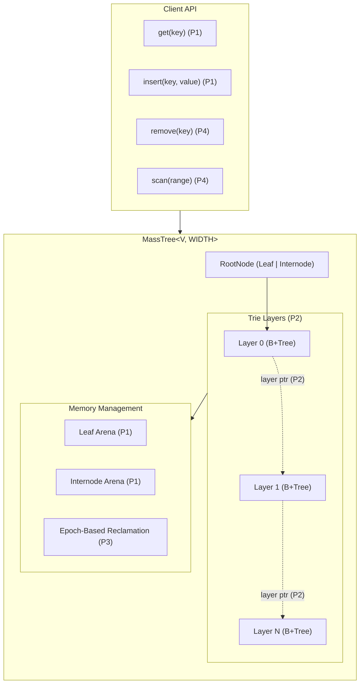
```mermaid
flowchart TB
    subgraph CLIENT["Client API"]
        GET["get(key) (P1)"]
        INSERT["insert(key, value) (P1)"]
        REMOVE["remove(key) (P4)"]
        SCAN["scan(range) (P4)"]
    end

    subgraph MASSTREE["MassTree&lt;V, WIDTH&gt;"]
        direction TB
        ROOT["RootNode (Leaf | Internode)"]

        subgraph LAYERS["Trie Layers (P2)"]
            L0["Layer 0 (B+Tree)"]
            L1["Layer 1 (B+Tree)"]
            LN["Layer N (B+Tree)"]
        end

        subgraph MEMORY["Memory Management"]
            LEAF_ARENA["Leaf Arena (P1)"]
            INODE_ARENA["Internode Arena (P1)"]
            EBR["Epoch-Based Reclamation (P3)"]
        end
    end

    CLIENT --> MASSTREE
    ROOT --> L0
    L0 -.->|"layer ptr (P2)"| L1
    L1 -.->|"layer ptr (P2)"| LN
    LAYERS --> MEMORY
```

> **Note:** Empty tree = root leaf with `permutation.size() == 0`. There is no `Empty` variant.

### Key Concepts

| Concept | Description |
|---------|-------------|
| **Trie** | Keys split into 8-byte slices; each slice handled by one layer |
| **B+Tree** | Each layer is a B+tree with fanout WIDTH (default 15) |
| **Layer** | When keys share an 8-byte prefix, they share a sublayer B+tree |
| **ikey** | 8-byte key slice stored as big-endian u64 for fast comparison |
| **Suffix** | Remaining bytes after current ikey stored in SuffixBag |

---

## Module Dependency Graph

> **Status:** Phase 1 (Implemented)

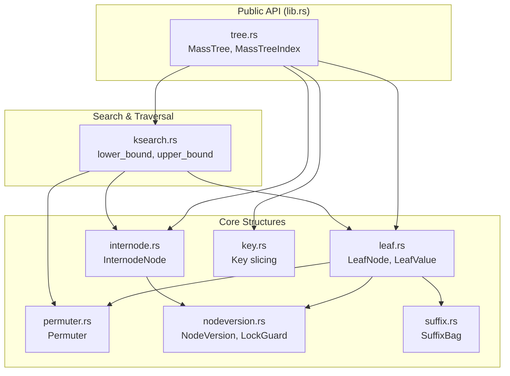
```mermaid
flowchart TD
    subgraph PUBLIC["Public API (lib.rs)"]
        TREE["tree.rs<br/>MassTree, MassTreeIndex"]
    end

    subgraph CORE["Core Structures"]
        LEAF["leaf.rs<br/>LeafNode, LeafValue"]
        INTERNODE["internode.rs<br/>InternodeNode"]
        KEY["key.rs<br/>Key slicing"]
        PERMUTER["permuter.rs<br/>Permuter"]
        NODEVERSION["nodeversion.rs<br/>NodeVersion, LockGuard"]
        SUFFIX["suffix.rs<br/>SuffixBag"]
    end

    subgraph SEARCH["Search & Traversal"]
        KSEARCH["ksearch.rs<br/>lower_bound, upper_bound"]
    end

    TREE --> LEAF
    TREE --> INTERNODE
    TREE --> KEY
    TREE --> KSEARCH

    LEAF --> PERMUTER
    LEAF --> NODEVERSION
    LEAF --> SUFFIX

    INTERNODE --> NODEVERSION

    KSEARCH --> LEAF
    KSEARCH --> INTERNODE
    KSEARCH --> PERMUTER
```

### Module Responsibilities

| Module | Purpose | Key Types |
|--------|---------|-----------|
| `lib.rs` | Public exports | `MassTree`, `MassTreeIndex` |
| `tree.rs` | Tree operations | `MassTree`, `RootNode`, `InsertError` |
| `leaf.rs` | Leaf nodes | `LeafNode`, `LeafValue`, `ModState` |
| `internode.rs` | Internal nodes | `InternodeNode` |
| `key.rs` | Key handling | `Key` (borrowed slice with shift state) |
| `permuter.rs` | Slot ordering | `Permuter` (u64-encoded permutation) |
| `nodeversion.rs` | Versioned locking | `NodeVersion`, `LockGuard` |
| `suffix.rs` | Long key storage | `SuffixBag`, `PermutationProvider` |
| `ksearch.rs` | Binary search | `lower_bound_leaf`, `upper_bound_internode` |

---

## Data Structure Hierarchy

> **Status:** Phase 1 (Implemented) - see inline notes for planned extensions

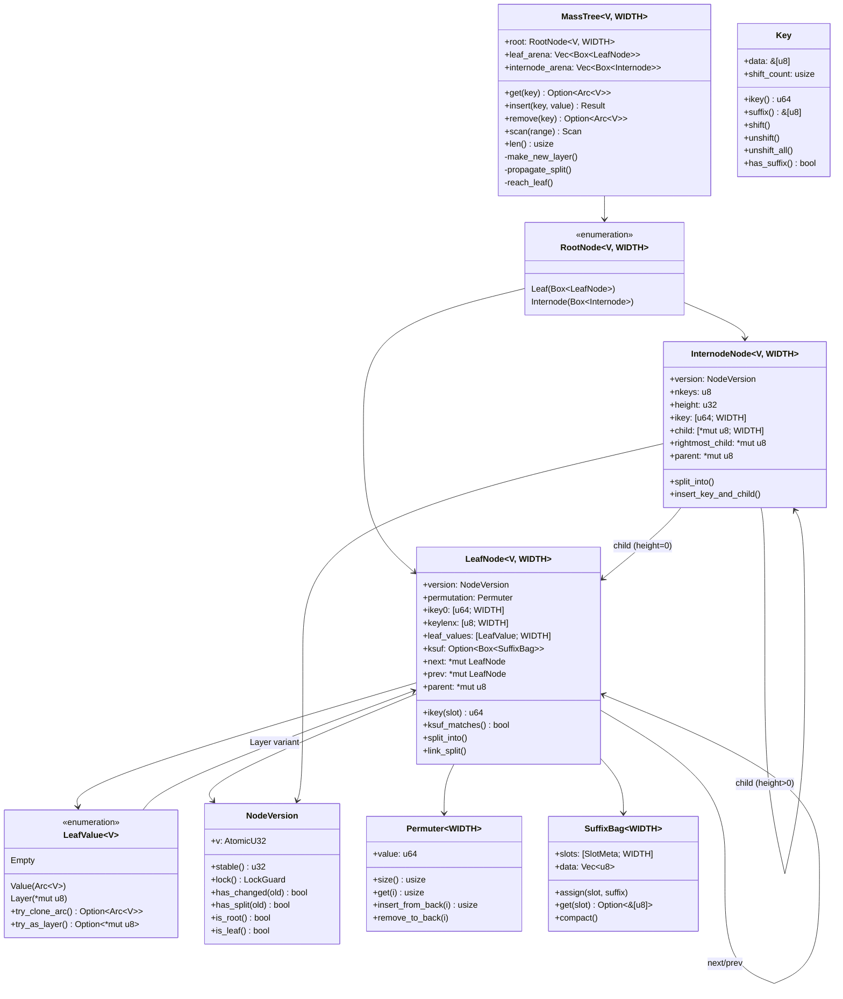
```mermaid
classDiagram
    class MassTree~V, WIDTH~ {
        +root: RootNode~V, WIDTH~
        +leaf_arena: Vec~Box~LeafNode~~
        +internode_arena: Vec~Box~Internode~~
        +get(key) Option~Arc~V~~
        +insert(key, value) Result
        +remove(key) Option~Arc~V~~
        +scan(range) Scan
        +len() usize
        -make_new_layer()
        -propagate_split()
        -reach_leaf()
    }

    class RootNode~V, WIDTH~ {
        <<enumeration>>
        Leaf(Box~LeafNode~)
        Internode(Box~Internode~)
    }

    class LeafNode~V, WIDTH~ {
        +version: NodeVersion
        +permutation: Permuter
        +ikey0: [u64; WIDTH]
        +keylenx: [u8; WIDTH]
        +leaf_values: [LeafValue; WIDTH]
        +ksuf: Option~Box~SuffixBag~~
        +next: *mut LeafNode
        +prev: *mut LeafNode
        +parent: *mut u8
        +ikey(slot) u64
        +ksuf_matches() bool
        +split_into()
        +link_split()
    }

    class InternodeNode~V, WIDTH~ {
        +version: NodeVersion
        +nkeys: u8
        +height: u32
        +ikey: [u64; WIDTH]
        +child: [*mut u8; WIDTH]
        +rightmost_child: *mut u8
        +parent: *mut u8
        +split_into()
        +insert_key_and_child()
    }

    class LeafValue~V~ {
        <<enumeration>>
        Empty
        Value(Arc~V~)
        Layer(*mut u8)
        +try_clone_arc() Option~Arc~V~~
        +try_as_layer() Option~*mut u8~
    }

    class NodeVersion {
        +v: AtomicU32
        +stable() u32
        +lock() LockGuard
        +has_changed(old) bool
        +has_split(old) bool
        +is_root() bool
        +is_leaf() bool
    }

    class Permuter~WIDTH~ {
        +value: u64
        +size() usize
        +get(i) usize
        +insert_from_back(i) usize
        +remove_to_back(i)
    }

    class SuffixBag~WIDTH~ {
        +slots: [SlotMeta; WIDTH]
        +data: Vec~u8~
        +assign(slot, suffix)
        +get(slot) Option~&[u8]~
        +compact()
    }

    class Key {
        +data: &[u8]
        +shift_count: usize
        +ikey() u64
        +suffix() &[u8]
        +shift()
        +unshift()
        +unshift_all()
        +has_suffix() bool
    }

    MassTree --> RootNode
    RootNode --> LeafNode
    RootNode --> InternodeNode
    LeafNode --> LeafValue
    LeafNode --> NodeVersion
    LeafNode --> Permuter
    LeafNode --> SuffixBag
    InternodeNode --> NodeVersion
    LeafNode --> LeafNode : next/prev
    InternodeNode --> LeafNode : child (height=0)
    InternodeNode --> InternodeNode : child (height>0)
    LeafValue --> LeafNode : Layer variant
```

> **Notes:**
>
> - **MassTree methods:** `get`/`insert`/`len` (P1), `remove`/`scan` (P4), `make_new_layer` (P2)
> - `RootNode` has no `Empty` variant; empty tree uses a root leaf with size 0
> - `InternodeNode` uses `child[WIDTH]` + `rightmost_child` to avoid `WIDTH+1` const generics
> - `Key::shift_by(bytes)` will be added in Phase 2 for layer descent
> - `ksuf_matches` currently returns `bool`; Phase 2 will extend to `i32` for layer detection

---

## Trie of B+Trees Structure

> **Status:** Phase 2 (Planned) - not implemented in current code. Phase 1 rejects keys >8 bytes.

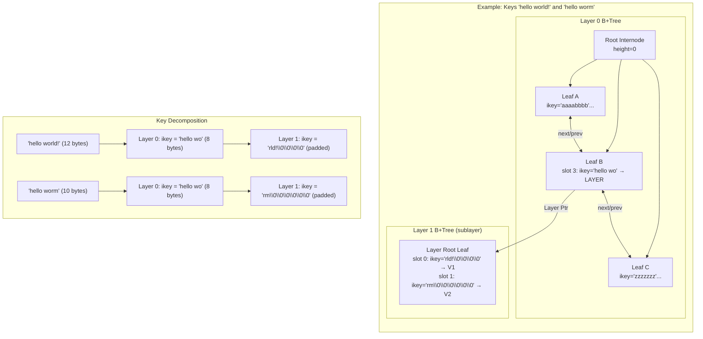
```mermaid
flowchart TB
    subgraph EXAMPLE["Example: Keys 'hello world!' and 'hello worm'"]
        direction TB

        subgraph LAYER0["Layer 0 B+Tree"]
            ROOT0["Root Internode<br/>height=0"]
            LEAF0A["Leaf A<br/>ikey='aaaabbbb'..."]
            LEAF0B["Leaf B<br/>slot 3: ikey='hello wo' → LAYER"]
            LEAF0C["Leaf C<br/>ikey='zzzzzzz'..."]

            ROOT0 --> LEAF0A
            ROOT0 --> LEAF0B
            ROOT0 --> LEAF0C
            LEAF0A <-->|"next/prev"| LEAF0B
            LEAF0B <-->|"next/prev"| LEAF0C
        end

        subgraph LAYER1["Layer 1 B+Tree (sublayer)"]
            LEAF1["Layer Root Leaf<br/>slot 0: ikey='rld!\\0\\0\\0\\0' → V1<br/>slot 1: ikey='rm\\0\\0\\0\\0\\0\\0' → V2"]
        end

        LEAF0B -->|"Layer Ptr"| LEAF1
    end

    subgraph KEYPATH["Key Decomposition"]
        K1["'hello world!' (12 bytes)"]
        K1_L0["Layer 0: ikey = 'hello wo' (8 bytes)"]
        K1_L1["Layer 1: ikey = 'rld!\\0\\0\\0\\0' (padded)"]

        K2["'hello worm' (10 bytes)"]
        K2_L0["Layer 0: ikey = 'hello wo' (8 bytes)"]
        K2_L1["Layer 1: ikey = 'rm\\0\\0\\0\\0\\0\\0' (padded)"]

        K1 --> K1_L0 --> K1_L1
        K2 --> K2_L0 --> K2_L1
    end
```

### Layer Creation Rules

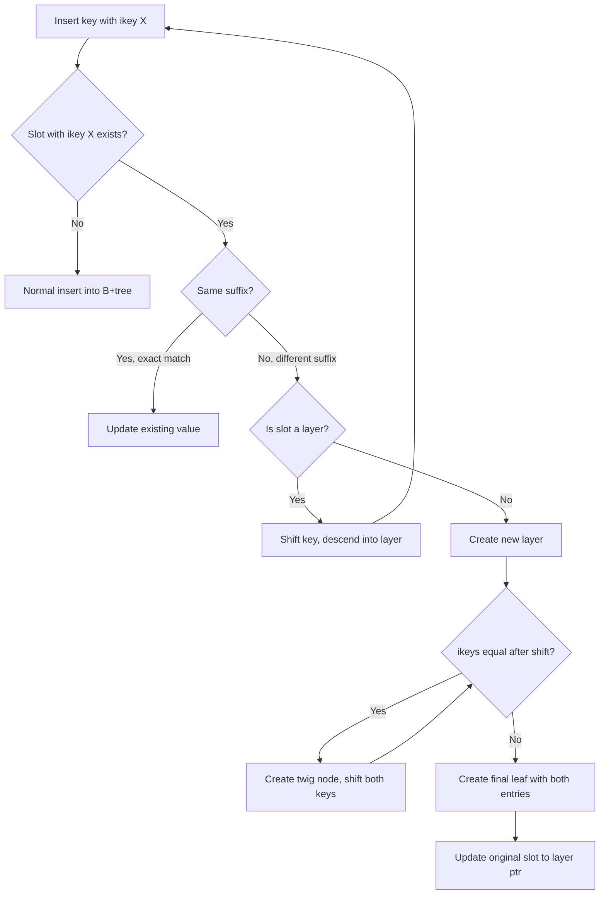
```mermaid
flowchart TD
    INSERT[Insert key with ikey X] --> CHECK{Slot with ikey X exists?}

    CHECK -->|No| NORMAL[Normal insert into B+tree]

    CHECK -->|Yes| COMPARE{Same suffix?}

    COMPARE -->|Yes, exact match| UPDATE[Update existing value]

    COMPARE -->|No, different suffix| LAYER{Is slot a layer?}

    LAYER -->|Yes| DESCEND[Shift key, descend into layer]
    DESCEND --> INSERT

    LAYER -->|No| CREATE[Create new layer]
    CREATE --> TWIG{ikeys equal after shift?}

    TWIG -->|Yes| TWIG_NODE[Create twig node, shift both keys]
    TWIG_NODE --> TWIG

    TWIG -->|No| FINAL[Create final leaf with both entries]
    FINAL --> DONE[Update original slot to layer ptr]
```

---

## Node Structures

> **Status:** Phase 1 (Implemented)

### LeafNode Memory Layout

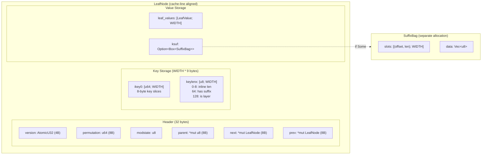
```mermaid
flowchart LR
    subgraph LEAFNODE["LeafNode (cache-line aligned)"]
        direction TB

        subgraph HEADER["Header (32 bytes)"]
            VERSION["version: AtomicU32 (4B)"]
            PERM["permutation: u64 (8B)"]
            MODSTATE["modstate: u8"]
            PARENT["parent: *mut u8 (8B)"]
            NEXT["next: *mut LeafNode (8B)"]
            PREV["prev: *mut LeafNode (8B)"]
        end

        subgraph KEYS["Key Storage (WIDTH * 9 bytes)"]
            IKEY0["ikey0: [u64; WIDTH]<br/>8-byte key slices"]
            KEYLENX["keylenx: [u8; WIDTH]<br/>0-8: inline len<br/>64: has suffix<br/>128: is layer"]
        end

        subgraph VALUES["Value Storage"]
            LV["leaf_values: [LeafValue; WIDTH]"]
            KSUF["ksuf: Option&lt;Box&lt;SuffixBag&gt;&gt;"]
        end
    end

    subgraph SUFFIXBAG["SuffixBag (separate allocation)"]
        SLOTS["slots: [(offset, len); WIDTH]"]
        DATA["data: Vec&lt;u8&gt;"]
    end

    KSUF -.->|"if Some"| SUFFIXBAG
```

### InternodeNode Memory Layout

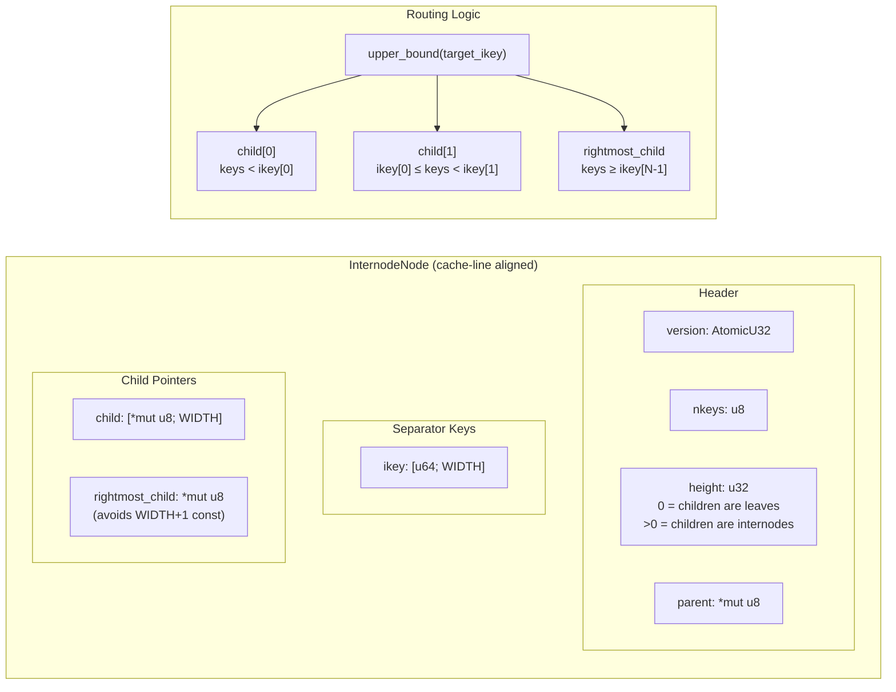
```mermaid
flowchart LR
    subgraph INTERNODE["InternodeNode (cache-line aligned)"]
        direction TB

        subgraph IHEADER["Header"]
            IVER["version: AtomicU32"]
            NKEYS["nkeys: u8"]
            HEIGHT["height: u32<br/>0 = children are leaves<br/>&gt;0 = children are internodes"]
            IPARENT["parent: *mut u8"]
        end

        subgraph IKEYS["Separator Keys"]
            IKEY["ikey: [u64; WIDTH]"]
        end

        subgraph CHILDREN["Child Pointers"]
            CHILD["child: [*mut u8; WIDTH]"]
            RIGHTMOST["rightmost_child: *mut u8<br/>(avoids WIDTH+1 const)"]
        end
    end

    subgraph ROUTING["Routing Logic"]
        SEARCH["upper_bound(target_ikey)"]
        SEARCH --> C0["child[0]<br/>keys &lt; ikey[0]"]
        SEARCH --> C1["child[1]<br/>ikey[0] ≤ keys &lt; ikey[1]"]
        SEARCH --> CN["rightmost_child<br/>keys ≥ ikey[N-1]"]
    end
```

---

## Operation Flows

> **Status:** Mixed - Basic traversal (P1), concurrent ops (P3), layer descent (P2)

### GET Operation

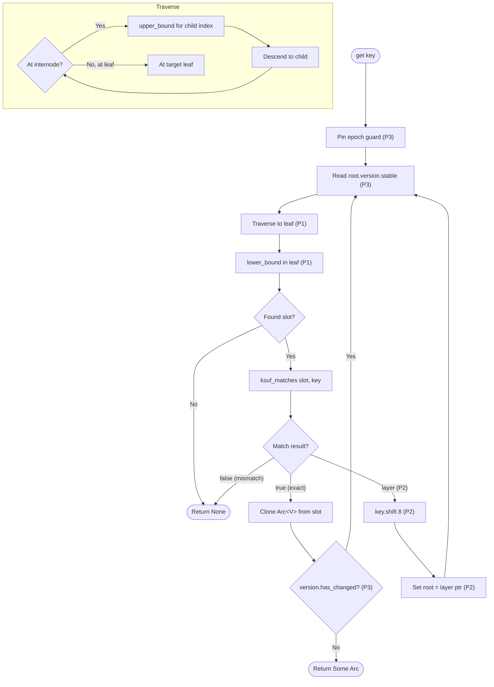
```mermaid
flowchart TD
    START([get key]) --> PIN["Pin epoch guard (P3)"]
    PIN --> STABLE["Read root.version.stable (P3)"]

    STABLE --> TRAVERSE["Traverse to leaf (P1)"]

    subgraph TRAVERSE_DETAIL["Traverse"]
        INTER{At internode?}
        INTER -->|Yes| SEARCH_I[upper_bound for child index]
        SEARCH_I --> DESCEND[Descend to child]
        DESCEND --> INTER
        INTER -->|No, at leaf| DONE_TRAV[At target leaf]
    end

    TRAVERSE --> SEARCH_L["lower_bound in leaf (P1)"]
    SEARCH_L --> FOUND{Found slot?}

    FOUND -->|No| NOT_FOUND([Return None])

    FOUND -->|Yes| MATCH[ksuf_matches slot, key]

    MATCH --> RESULT{Match result?}

    RESULT -->|"true (exact)"| CLONE[Clone Arc&lt;V&gt; from slot]
    CLONE --> VALIDATE{"version.has_changed? (P3)"}
    VALIDATE -->|Yes| STABLE
    VALIDATE -->|No| RETURN([Return Some Arc])

    RESULT -->|"layer (P2)"| SHIFT["key.shift 8 (P2)"]
    SHIFT --> LAYER_ROOT["Set root = layer ptr (P2)"]
    LAYER_ROOT --> STABLE

    RESULT -->|"false (mismatch)"| NOT_FOUND
```

### INSERT Operation

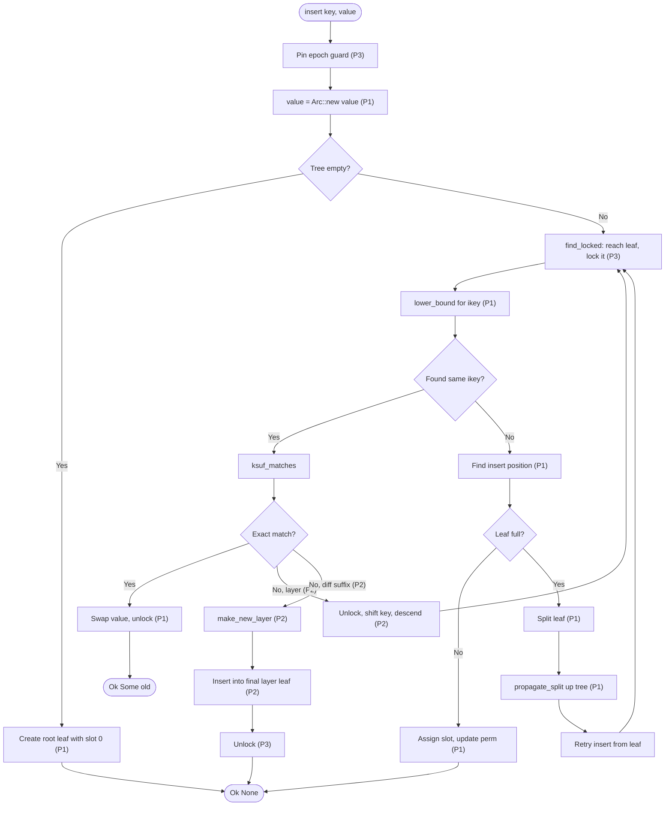
```mermaid
flowchart TD
    START([insert key, value]) --> PIN["Pin epoch guard (P3)"]
    PIN --> WRAP["value = Arc::new value (P1)"]

    WRAP --> EMPTY{Tree empty?}
    EMPTY -->|Yes| CREATE_ROOT["Create root leaf with slot 0 (P1)"]
    CREATE_ROOT --> OK_NONE([Ok None])

    EMPTY -->|No| FIND_LOCK["find_locked: reach leaf, lock it (P3)"]

    FIND_LOCK --> SCAN["lower_bound for ikey (P1)"]

    SCAN --> FOUND{Found same ikey?}

    FOUND -->|Yes| KSUF[ksuf_matches]
    KSUF --> EXACT{Exact match?}
    EXACT -->|Yes| UPDATE["Swap value, unlock (P1)"]
    UPDATE --> OK_OLD([Ok Some old])

    EXACT -->|"No, layer (P2)"| DESCEND["Unlock, shift key, descend (P2)"]
    DESCEND --> FIND_LOCK

    EXACT -->|"No, diff suffix (P2)"| MAKE_LAYER["make_new_layer (P2)"]
    MAKE_LAYER --> FINISH_INSERT["Insert into final layer leaf (P2)"]
    FINISH_INSERT --> UNLOCK1["Unlock (P3)"]
    UNLOCK1 --> OK_NONE

    FOUND -->|No| INSERT_POS["Find insert position (P1)"]
    INSERT_POS --> FULL{Leaf full?}

    FULL -->|No| SIMPLE["Assign slot, update perm (P1)"]
    SIMPLE --> OK_NONE

    FULL -->|Yes| SPLIT["Split leaf (P1)"]
    SPLIT --> PROPAGATE["propagate_split up tree (P1)"]
    PROPAGATE --> RETRY[Retry insert from leaf]
    RETRY --> FIND_LOCK
```

### SPLIT Propagation

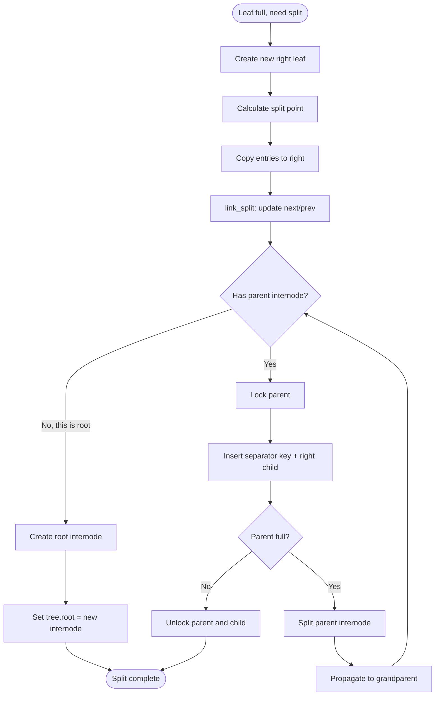
```mermaid
flowchart TD
    START([Leaf full, need split]) --> CREATE_RIGHT[Create new right leaf]

    CREATE_RIGHT --> CALC[Calculate split point]
    CALC --> COPY[Copy entries to right]
    COPY --> LINK[link_split: update next/prev]

    LINK --> PARENT{Has parent internode?}

    PARENT -->|No, this is root| NEW_ROOT[Create root internode]
    NEW_ROOT --> SET_ROOT[Set tree.root = new internode]
    SET_ROOT --> DONE([Split complete])

    PARENT -->|Yes| LOCK_PARENT[Lock parent]
    LOCK_PARENT --> INSERT_SEP[Insert separator key + right child]

    INSERT_SEP --> PARENT_FULL{Parent full?}

    PARENT_FULL -->|No| UNLOCK[Unlock parent and child]
    UNLOCK --> DONE

    PARENT_FULL -->|Yes| SPLIT_PARENT[Split parent internode]
    SPLIT_PARENT --> PROPAGATE[Propagate to grandparent]
    PROPAGATE --> PARENT
```

---

## Concurrency Model

> **Status:** Phase 3 (Planned) - current code is single-threaded with load-then-store locking

### Optimistic Read Protocol

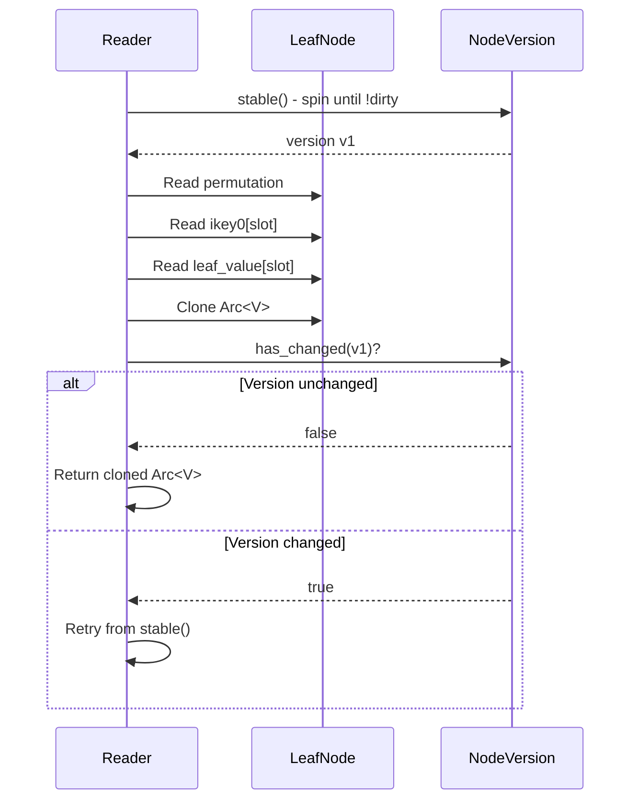
```mermaid
sequenceDiagram
    participant R as Reader
    participant L as LeafNode
    participant V as NodeVersion

    R->>V: stable() - spin until !dirty
    V-->>R: version v1

    R->>L: Read permutation
    R->>L: Read ikey0[slot]
    R->>L: Read leaf_value[slot]
    R->>L: Clone Arc<V>

    R->>V: has_changed(v1)?

    alt Version unchanged
        V-->>R: false
        R->>R: Return cloned Arc<V>
    else Version changed
        V-->>R: true
        R->>R: Retry from stable()
    end
```

### Write Locking Protocol

> **Note:** Current P1 implementation uses load-then-store; CAS loop shown is the P3 target.

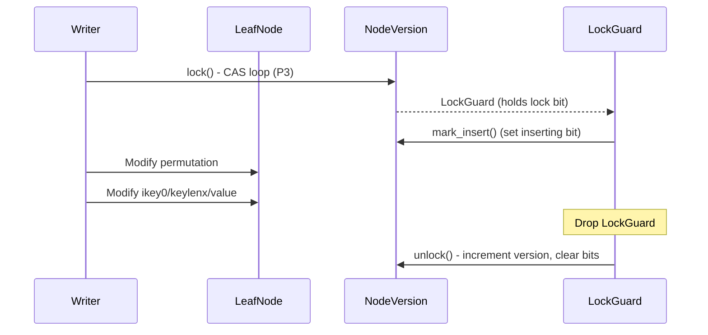
```mermaid
sequenceDiagram
    participant W as Writer
    participant L as LeafNode
    participant V as NodeVersion
    participant G as LockGuard

    W->>V: lock() - CAS loop (P3)
    V-->>G: LockGuard (holds lock bit)

    G->>V: mark_insert() (set inserting bit)

    W->>L: Modify permutation
    W->>L: Modify ikey0/keylenx/value

    Note over G: Drop LockGuard
    G->>V: unlock() - increment version, clear bits
```

### Hand-Over-Hand Locking (Split Propagation)

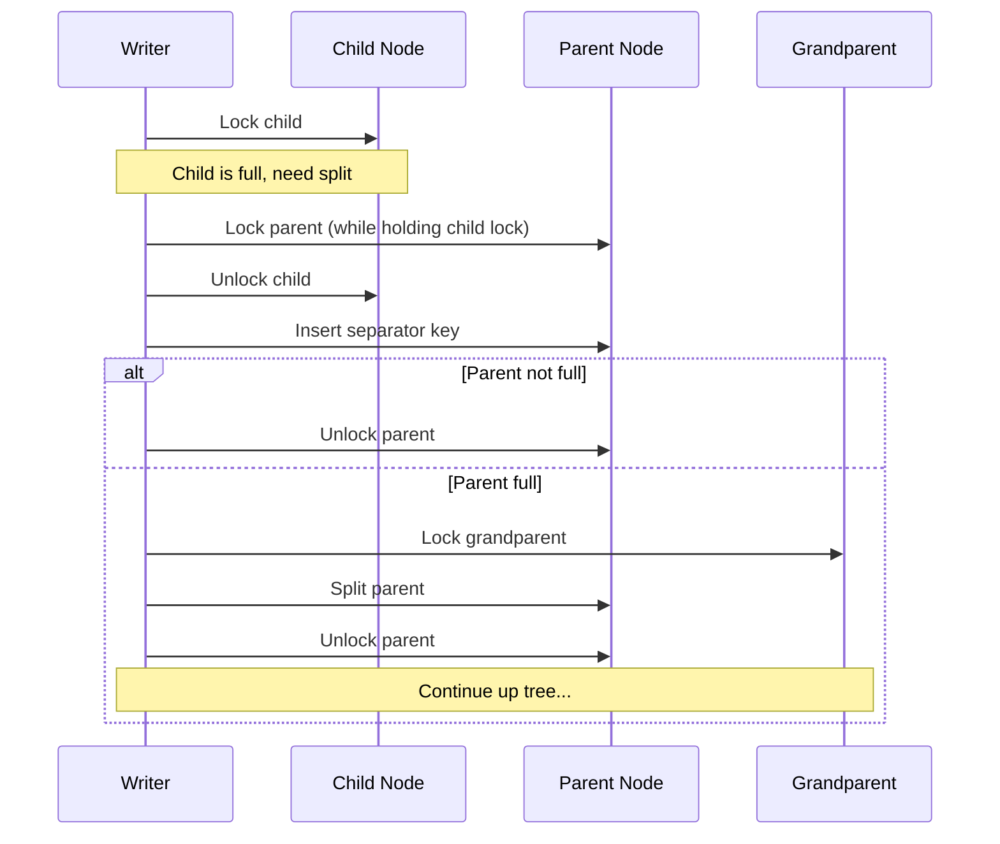
```mermaid
sequenceDiagram
    participant W as Writer
    participant C as Child Node
    participant P as Parent Node
    participant G as Grandparent

    W->>C: Lock child
    Note over W,C: Child is full, need split

    W->>P: Lock parent (while holding child lock)
    W->>C: Unlock child

    W->>P: Insert separator key

    alt Parent not full
        W->>P: Unlock parent
    else Parent full
        W->>G: Lock grandparent
        W->>P: Split parent
        W->>P: Unlock parent
        Note over W,G: Continue up tree...
    end
```

### Epoch-Based Reclamation

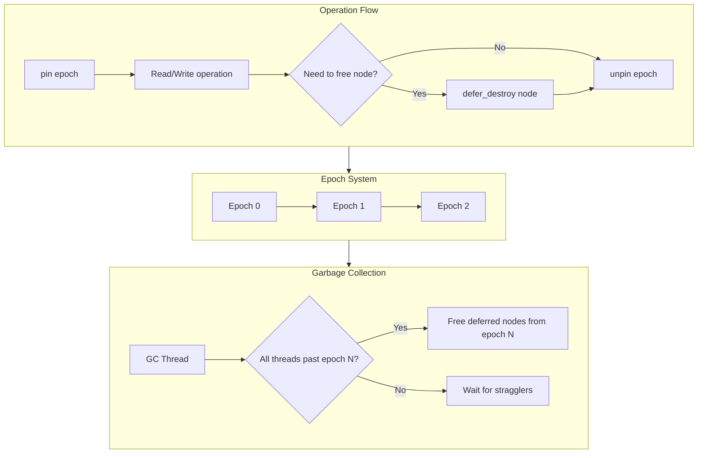
```mermaid
flowchart TD
    subgraph EPOCHS["Epoch System"]
        E0["Epoch 0"]
        E1["Epoch 1"]
        E2["Epoch 2"]
        E0 --> E1 --> E2
    end

    subgraph OPERATION["Operation Flow"]
        PIN[pin epoch] --> READ[Read/Write operation]
        READ --> DEFER{Need to free node?}
        DEFER -->|Yes| GARBAGE["defer_destroy node"]
        DEFER -->|No| UNPIN
        GARBAGE --> UNPIN[unpin epoch]
    end

    subgraph RECLAMATION["Garbage Collection"]
        GC[GC Thread]
        GC --> CHECK{All threads past epoch N?}
        CHECK -->|Yes| FREE[Free deferred nodes from epoch N]
        CHECK -->|No| WAIT[Wait for stragglers]
    end

    OPERATION --> EPOCHS
    EPOCHS --> RECLAMATION
```

---

## Memory Management

> **Status:** Mixed - Arena allocation (P1), Epoch-Based Reclamation (P3)

### Allocation Strategy

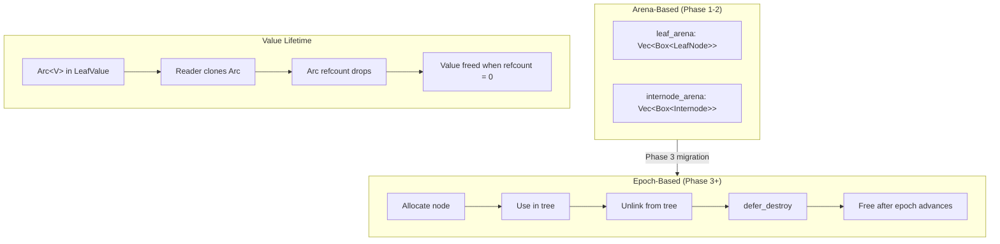
```mermaid
flowchart TB
    subgraph ARENA["Arena-Based (Phase 1-2)"]
        LEAF_ARENA["leaf_arena: Vec&lt;Box&lt;LeafNode&gt;&gt;"]
        INODE_ARENA["internode_arena: Vec&lt;Box&lt;Internode&gt;&gt;"]
    end

    subgraph EBR["Epoch-Based (Phase 3+)"]
        ALLOC[Allocate node]
        USE[Use in tree]
        UNLINK[Unlink from tree]
        DEFER[defer_destroy]
        FREE[Free after epoch advances]

        ALLOC --> USE --> UNLINK --> DEFER --> FREE
    end

    subgraph VALUES["Value Lifetime"]
        ARC["Arc&lt;V&gt; in LeafValue"]
        READER["Reader clones Arc"]
        DROP["Arc refcount drops"]
        VFREE["Value freed when refcount = 0"]

        ARC --> READER --> DROP --> VFREE
    end

    ARENA -->|"Phase 3 migration"| EBR
```

### Pointer Discipline

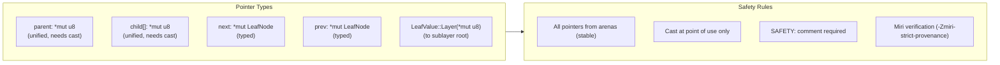
```mermaid
flowchart LR
    subgraph POINTERS["Pointer Types"]
        PARENT["parent: *mut u8<br/>(unified, needs cast)"]
        CHILD["child[]: *mut u8<br/>(unified, needs cast)"]
        NEXT["next: *mut LeafNode<br/>(typed)"]
        PREV["prev: *mut LeafNode<br/>(typed)"]
        LAYER["LeafValue::Layer(*mut u8)<br/>(to sublayer root)"]
    end

    subgraph RULES["Safety Rules"]
        R1["All pointers from arenas (stable)"]
        R2["Cast at point of use only"]
        R3["SAFETY: comment required"]
        R4["Miri verification (-Zmiri-strict-provenance)"]
    end

    POINTERS --> RULES
```

---

## Value Storage Modes

> **Status:** Phase 1 (Implemented) - see notes on MassTreeIndex

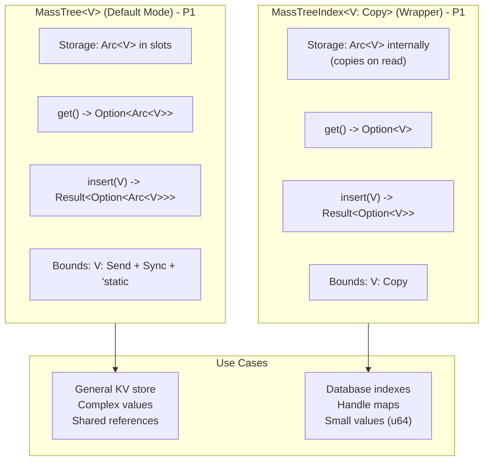
```mermaid
flowchart TB
    subgraph DEFAULT["MassTree&lt;V&gt; (Default Mode) - P1"]
        direction LR
        D_STORE["Storage: Arc&lt;V&gt; in slots"]
        D_GET["get() -> Option&lt;Arc&lt;V&gt;&gt;"]
        D_INSERT["insert(V) -> Result&lt;Option&lt;Arc&lt;V&gt;&gt;&gt;"]
        D_BOUNDS["Bounds: V: Send + Sync + 'static"]
    end

    subgraph INDEX["MassTreeIndex&lt;V: Copy&gt; (Wrapper) - P1"]
        direction LR
        I_STORE["Storage: Arc&lt;V&gt; internally<br/>(copies on read)"]
        I_GET["get() -> Option&lt;V&gt;"]
        I_INSERT["insert(V) -> Result&lt;Option&lt;V&gt;&gt;"]
        I_BOUNDS["Bounds: V: Copy"]
    end

    subgraph USECASES["Use Cases"]
        UC_DEFAULT["General KV store<br/>Complex values<br/>Shared references"]
        UC_INDEX["Database indexes<br/>Handle maps<br/>Small values (u64)"]
    end

    DEFAULT --> UC_DEFAULT
    INDEX --> UC_INDEX
```

> **Note on MassTreeIndex:** Currently a convenience wrapper over `MassTree<V>` that stores
> `Arc<V>` internally and copies on read. True inline storage is planned for a future release.

---

## Phase Progression

```mermaid
gantt
    title MassTree Implementation Phases
    dateFormat X
    axisFormat %s

    section Phase 1
    Key Module           :done, p1_1, 0, 1
    Permuter             :done, p1_2, 1, 2
    NodeVersion          :done, p1_3, 2, 3
    LeafNode             :done, p1_4, 3, 4
    InternodeNode        :done, p1_5, 4, 5
    Binary Search        :done, p1_6, 5, 6
    Get/Insert           :done, p1_7, 6, 7
    Leaf/Internode Split :done, p1_8, 7, 8

    section Phase 2
    Suffix Storage (SuffixBag) :active, p2_1, 8, 9
    Layer Detection            :p2_2, 9, 10
    Layer Creation             :p2_3, 10, 11
    Layer Descent (Get)        :p2_4, 11, 12
    Layer Descent (Insert)     :p2_5, 12, 13

    section Phase 3
    Atomic NodeVersion   :p3_1, 13, 14
    Optimistic Get       :p3_2, 14, 15
    Locked Insert        :p3_3, 15, 16
    Epoch-Based Reclaim  :p3_4, 16, 17
    Lock-Free Leaf Links :p3_5, 17, 18
    Hand-Over-Hand Lock  :p3_6, 18, 19

    section Phase 4
    Forward Scan         :p4_1, 19, 20
    Reverse Scan         :p4_2, 20, 21
    Remove Operation     :p4_3, 21, 22
    Layer GC             :p4_4, 22, 23

    section Phase 5
    Prefetching          :p5_1, 23, 24
    Memory Ordering Opt  :p5_2, 24, 25
    Benchmarking Suite   :p5_3, 25, 26
```

### Phase Summary

| Phase | Focus | Key Deliverables |
|-------|-------|------------------|
| **1** | Foundation | Single-threaded core, 0-8 byte keys, get/insert/split |
| **2** | Trie Layering | Suffix storage, layer creation/descent, arbitrary key lengths |
| **3** | Concurrency | Atomic ops, optimistic reads, locked writes, EBR |
| **4** | Full Operations | Scan iterators, remove, layer garbage collection |
| **5** | Optimization | Prefetching, memory ordering, SIMD, benchmarks |

---

## Complete System Diagram

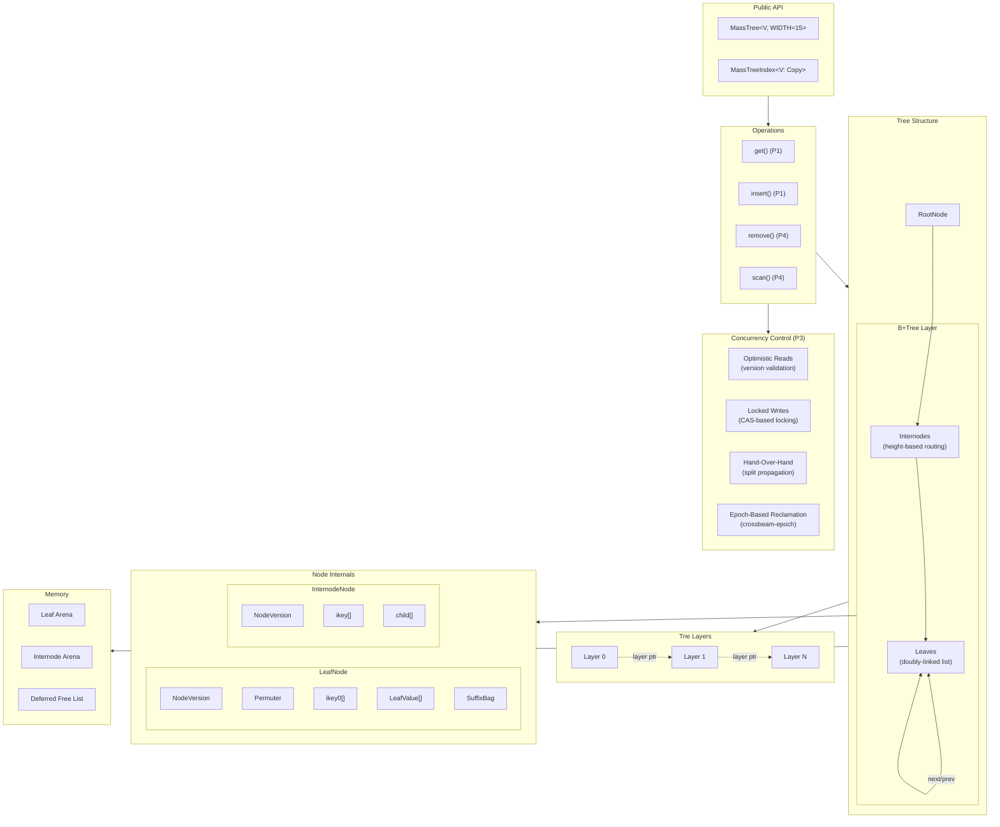
```mermaid
flowchart TB
    subgraph API["Public API"]
        MT["MassTree&lt;V, WIDTH=15&gt;"]
        MTI["MassTreeIndex&lt;V: Copy&gt;"]
    end

    subgraph OPS["Operations"]
        GET["get() (P1)"]
        INSERT["insert() (P1)"]
        REMOVE["remove() (P4)"]
        SCAN["scan() (P4)"]
    end

    subgraph TREE["Tree Structure"]
        ROOT["RootNode"]

        subgraph BTREE["B+Tree Layer"]
            INODES["Internodes<br/>(height-based routing)"]
            LEAVES["Leaves<br/>(doubly-linked list)"]
        end

        ROOT --> INODES
        INODES --> LEAVES
        LEAVES <-->|"next/prev"| LEAVES
    end

    subgraph LAYERS["Trie Layers"]
        L0["Layer 0"]
        L1["Layer 1"]
        LN["Layer N"]

        L0 -.->|"layer ptr"| L1
        L1 -.->|"layer ptr"| LN
    end

    subgraph NODES["Node Internals"]
        subgraph LN_DETAIL["LeafNode"]
            VERSION["NodeVersion"]
            PERM["Permuter"]
            IKEYS["ikey0[]"]
            VALUES["LeafValue[]"]
            SUFFIX["SuffixBag"]
        end

        subgraph IN_DETAIL["InternodeNode"]
            IVER["NodeVersion"]
            SEPS["ikey[]"]
            CHILDREN["child[]"]
        end
    end

    subgraph CONCURRENCY["Concurrency Control (P3)"]
        OPT["Optimistic Reads<br/>(version validation)"]
        LOCK["Locked Writes<br/>(CAS-based locking)"]
        HOH["Hand-Over-Hand<br/>(split propagation)"]
        EBR["Epoch-Based Reclamation<br/>(crossbeam-epoch)"]
    end

    subgraph MEMORY["Memory"]
        LEAF_ARENA["Leaf Arena"]
        INODE_ARENA["Internode Arena"]
        DEFERRED["Deferred Free List"]
    end

    API --> OPS
    OPS --> TREE
    TREE --> LAYERS
    BTREE --> NODES
    OPS --> CONCURRENCY
    TREE --> MEMORY
```

---

## Key Invariants

### Structural Invariants

1. **Permuter Invariant** (P1): All 15 slots appear exactly once in the u64 encoding
2. **Slot-0 Rule** (P1): Slot 0's ikey must equal `ikey_bound()` (unless first leaf or same ikey)
3. **Height Semantics** (P1): `height == 0` means children are leaves; `height > 0` means internodes
4. **Layer Root** (P2): Layer roots have `parent == null` and `version.is_root() == true`
5. **Leaf List** (P1): All leaves in a layer form a consistent doubly-linked list

### Concurrency Invariants

1. **Version Ordering** (P3): Writers increment version on unlock; readers retry if version changed
2. **Lock Exclusivity** (P3): Only one writer holds a node's lock at a time
3. **Epoch Safety** (P3): Nodes are not freed while any thread may hold references
4. **Arc Lifetime** (P1): Values outlive nodes via Arc reference counting

### Memory Invariants

1. **Arena Stability** (P1): Pointers remain valid for tree lifetime (arena never shrinks)
2. **Provenance** (P1): All pointer operations preserve strict provenance
3. **Alignment** (P1): Nodes are 64-byte aligned for cache efficiency

---

**Generated from:** CODE_011_FLOW.md, TODO.md, CODE_010.md, CODE_011.md
**Last Updated:** 2025-12-16
**Reviewed and corrected:** Based on ArchReview.md findings - fixed 9 structural/API mismatches
